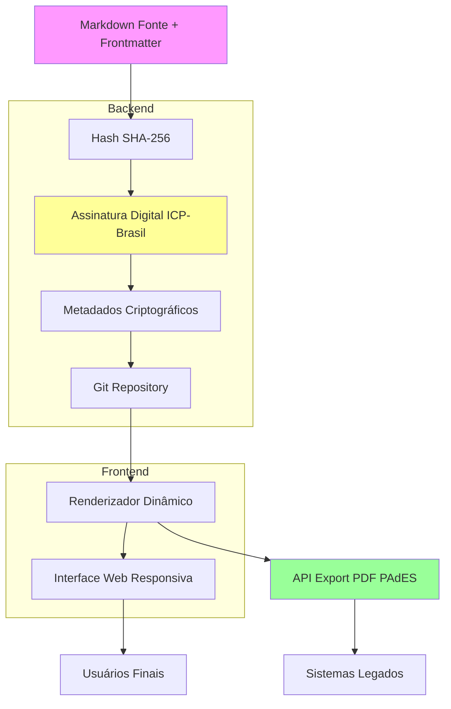

# 🚀 **PROJETO MARKSIGN**  
## Plataforma de Assinatura Digital Nativa para Arquivos Markdown

---

## **1. EXECUTIVO**

### **1.1 Visão Geral**
**MarkSign** é a primeira plataforma SaaS global especializada em **assinatura digital nativa para arquivos Markdown**, resolvendo o problema de instituições como a OABPR que armazenam 95% de documentos em PDF, ocupando espaço excessivo e dificultando leitura/busca. 

**Proposta de Valor**: Armazenamento 99% mais eficiente, versionamento Git nativo, assinatura ICP-Brasil/eIDAS via hash criptográfico, renderização dinâmica e exportação PDF PAdES sob demanda.

### **1.2 Problema de Mercado**
- **95% documentos institucionais** em PDF (pesado, busca limitada)
- **Silos informacionais** entre sistemas legados
- **Falta de interoperabilidade** entre portais Markdown ↔ assinatura digital
- **Custo de armazenamento** crescente (ex.: OABPR com TBs de PDFs redundantes)
- **Ausência de produtos nativos** para assinatura de formatos leves

### **1.3 Solução**
- **Armazenamento nativo Markdown** com metadados YAML frontmatter
- **Assinatura criptográfica** do hash SHA-256 + timestamping
- **Renderização dinâmica** HTML/CSS responsivo
- **Exportação automática** PDF PAdES assinado
- **API unificada** para sistemas integrados (SharePoint, GitHub, intranet)

### **1.4 Métricas de Impacto**
- **Redução 99%** espaço disco (20KB vs 2MB por documento)
- **Busca 10x mais rápida** full-text semântica
- **Conformidade legal** ICP-Brasil/eIDAS/UETA
- **Versionamento automático** Git com diff visual assinadas

---

## **2. ANÁLISE DE MERCADO**

### **2.1 Tamanho e Crescimento**
| Mercado | Valor 2024 | Projeção 2030 | CAGR |
|---------|------------|---------------|------|
| **Assinatura Digital Global** | US$ 9,9B | US$ 70B | 38,5% |
| **Software DMS** | US$ 10B | US$ 25B | 15,8% |
| **Brasil (ICP-Brasil)** | R$ 2B | R$ 8B | 26% |

**Oportunidade Nicho**: 5-10% do mercado de assinatura digital (US$ 3,5B-7B em 2030) para formatos leves.

### **2.2 Público-Alvo**
1. **Setor Jurídico** (40%): OABs, tribunais, escritórios (ex.: OABPR com 95% PDF)
2. **Governança Pública** (30%): Conselhos profissionais, autarquias
3. **Tech/DevOps** (20%): Equipes GitHub, documentação técnica assinada
4. **PMEs** (10%): Redução custos armazenamento/assinatura

### **2.3 Concorrência**
| Competidor | Suporte Markdown | Assinatura Nativa | Preço | Gap |
|------------|------------------|-------------------|-------|-----|
| **DocuSign** | Híbrido (conversão) | PDF | US$10/mês | Não nativo |
| **Clicksign** | Texto plano | PDF+ICP | R$39/mês | Conversão manual |
| **Adobe Sign** | Parcial | PDF PAdES | US$23/mês | Ecossistema fechado |

**Diferencial Competitivo**: Único produto com assinatura nativa Markdown + Git + conformidade global.

---

## **3. PRODUTO**

### **3.1 Arquitetura Técnica**



### **3.2 Funcionalidades Core**

#### **3.2.1 Criação e Edição**
- Editor Markdown WYSIWYG integrado (VS Code-like)
- Validação automática metadados obrigatórios
- Preview tempo real com templates institucionais
- Auto-save Git com commits assinados

#### **3.2.2 Assinatura Digital**
```yaml
# Exemplo Documento Assinado
---
id: OABPR-REG-001-2024
titulo: Regimento Interno
hash_sha256: "a1b2c3d4e5f67890..."
assinatura: "MEUCIQDC...=="
certificado: "CertiSign ICP-Brasil v2.0"
timestamp: "2024-10-15T10:30:00Z"
status: assinado_vigente
---
# Conteúdo Markdown...
```

#### **3.2.3 Renderização**
- **HTML5/CSS3** responsivo com temas customizáveis
- **Table of Contents** automático
- **Breadcrumbs** semânticos
- **Dark/Light mode** accessibility

#### **3.2.4 Verificação**
- **Validador online** hash + assinatura
- **API de integridade** para sistemas terceiros
- **Blockchain timestamping** opcional
- **Relatórios auditoria** completos

### **3.3 Integrações**
- **CertiSign/Serasa** (ICP-Brasil)
- **GitHub Enterprise** versionamento
- **SharePoint/Teams** sincronização
- **Elasticsearch** busca semântica
- **Zapier** automações

---

## **4. ESTRATÉGIA GO-TO-MARKET**

### **4.1 Modelo de Negócios**
- **Freemium**: Até 100 docs/mês grátis
- **SaaS**: US$ 25-99/usuário/mês
- **Enterprise**: Custom (HSM, white-label)
- **API**: Pay-per-use (US$ 0,01/signature)

### **4.2 Aquisição de Clientes**
1. **Fase 1 (0-6 meses)**: OABs, conselhos profissionais Brasil
2. **Fase 2 (6-18 meses)**: Governo estadual/federal
3. **Fase 3 (18+ meses)**: Expansão EU/EUA (eIDAS/ESIGN)

### **4.3 Parcerias Estratégicas**
- **CertiSign** (ICP-Brasil certificação)
- **GitHub** (marketplace integration)
- **Microsoft** (Azure/SharePoint)
- **DocuSign** (white-label option)

### **4.4 Marketing**
- **Content Marketing**: Cases OABPR, whitepapers conformidade
- **Conferências**: LegalTech, GovTech Brasil/EU
- **Inbound**: SEO "assinatura digital Markdown"
- **Outbound**: SDRs segmentados jurídico/governo

---

## **5. DESENVOLVIMENTO E ROADMAP**

### **5.1 Fases de Desenvolvimento**

#### **MVP (3 meses)**
```yaml
# Features MVP
- [ ] Editor Markdown básico
- [ ] Assinatura hash + CertiSign API
- [ ] Renderização HTML simples
- [ ] Export PDF Pandoc
- [ ] Verificador integridade
- [ ] 1 template institucional
```

#### **V1.0 (6 meses)**
- Editor WYSIWYG completo
- Múltiplos provedores assinatura (ICP, eIDAS)
- Git integration nativa
- API RESTful
- Templates customizáveis
- Mobile responsive

#### **V2.0 (12 meses)**
- Blockchain timestamping
- HSM support enterprise
- AI busca semântica
- Workflows colaborativos
- White-label
- Multi-idioma

### **5.2 Stack Tecnológica**
```yaml
Frontend: React + Tailwind + Monaco Editor
Backend: Node.js + Express + TypeScript
Banco: PostgreSQL + Redis
Armazenamento: Git LFS + S3
Assinatura: node-forge + CertiSign SDK
Render: Remark + Rehype
PDF: Puppeteer + PAdES
CI/CD: GitHub Actions
Cloud: AWS/Azure (multi-cloud)
```

### **5.3 Equipe**
- **CTO**: Arquiteto blockchain/PKI
- **2 Fullstack Devs**: React/Node
- **1 DevOps**: CI/CD, cloud
- **1 Especialista LegalTech**: Conformidade
- **1 Product Manager**: UX/roadmap
- **1 Sales**: Parcerias jurídicas

---

## **6. FINANCEIRO**

### **6.1 Projeções de Receita**
| Ano | Clientes | ARPU | Receita | Custos | Lucro |
|-----|----------|------|---------|--------|-------|
| **2026** | 500 | US$500/mês | US$3M | US$1,5M | US$1,5M |
| **2027** | 2.000 | US$600/mês | US$14,4M | US$5M | US$9,4M |
| **2028** | 5.000 | US$700/mês | US$42M | US$12M | US$30M |

### **6.2 Investimento Necessário**
- **Seed (US$ 1M)**: MVP + equipe inicial + marketing Brasil
- **Série A (US$ 5M)**: Escala global + parcerias
- **ROI projetado**: 5x em 3 anos

### **6.3 CAPEX/OPEX**
```yaml
CAPEX Inicial:
  - Infra cloud: US$ 50K
  - Certificados HSM: US$ 100K
  - Licenças: US$ 20K
  
OPEX Mensal:
  - Equipe (6 pessoas): US$ 40K
  - Cloud: US$ 5K
  - Marketing: US$ 10K
  - Legal/compliance: US$ 5K
```

---

## **7. RISCOS E MITIGAÇÕES**

### **7.1 Riscos Técnicos**
- **Complexidade PKI**: Parceria CertiSign desde MVP
- **Performance escala**: Arquitetura serverless
- **Compatibilidade**: Suporte multi-formato fallback

### **7.2 Riscos Legais**
- **Conformidade global**: Consultoria especializada eIDAS/ICP
- **Responsabilidade civil**: Seguro cyber + auditorias
- **Privacidade**: GDPR/LGPD desde design

### **7.3 Riscos Mercado**
- **Adoção lenta**: Freemium + cases OABPR
- **Concorrência**: Diferencial nicho Markdown
- **Regulamentação**: Monitoramento mudanças ICP-Brasil

---

## **8. GOVERNANÇA E ÉTICA**

### **8.1 Conformidade**
- **ICP-Brasil** (MP 2.200-2/2001)
- **eIDAS** (EU Regulation 910/2014)
- **ESIGN/UETA** (EUA)
- **LGPD/GDPR** privacy by design

### **8.2 Segurança**
- **HSM FIPS 140-2** para chaves privadas
- **Zero-knowledge** proof para verificação
- **SOC 2 Type II** auditoria anual
- **Bug bounty** programa

### **8.3 Sustentabilidade**
- **Carbon neutral** cloud operations
- **Open-source** componentes não-críticos
- **Documentação** acessível WCAG 2.1

---

## **9. MÉTRICAS DE SUCESSO**

### **9.1 KPIs Produto**
- **95% uptime** SLA
- **< 2s** tempo assinatura
- **99,9%** taxa verificação válida
- **50% redução** tempo gestão docs

### **9.2 KPIs Negócios**
- **MRR growth**: 20% MoM primeiros 12 meses
- **Churn**: < 5% anual
- **NPS**: > 70
- **CAC payback**: < 6 meses

### **9.3 KPIs Conformidade**
- **100% auditorias** aprovadas
- **Zero incidentes** segurança
- **99% docs** validados ICP-Brasil

---

## **10. CONCLUSÃO E CALL TO ACTION**

**MarkSign** não é apenas um produto – é a **revolução na gestão documental institucional**. Resolvendo problemas reais como os da OABPR (95% PDFs, silos informacionais), oferece uma solução nativa que nenhum competidor tem coragem de construir.

### **Próximos Passos Imediatos**
1. **PoC OABPR** (30 dias): 100 docs migrados + assinaturas teste
2. **MVP desenvolvimento** (90 dias): Editor + assinatura básica
3. **Beta fechado** (Q2 2026): 10 instituições jurídicas
4. **Lançamento público** (Q3 2026): Freemium global

### **Investimento Mínimo Viável**
**US$ 1M seed** para validar mercado e construir MVP funcional.

**Contato**: `contato@marksign.com` | **Demo**: [marksign.com/demo](https://marksign.com/demo)

---

**MarkSign: Onde Markdown encontra a confiança digital. Transformando documentos em provas legais.**

*Desenvolvido com base na análise técnica e de mercado realizada para otimização documental da OABPR, outubro 2025.*